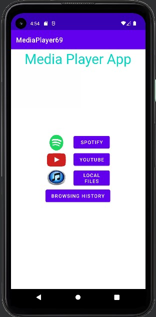
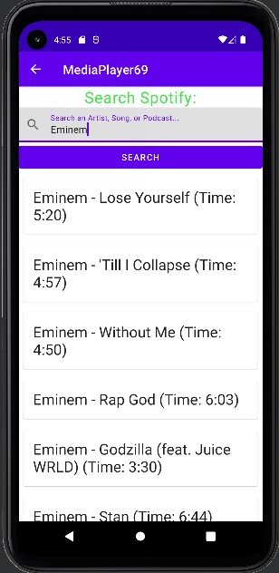
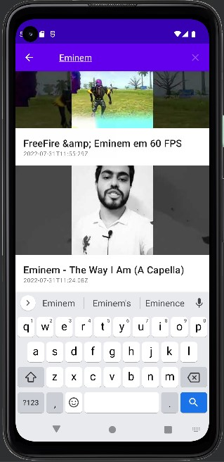
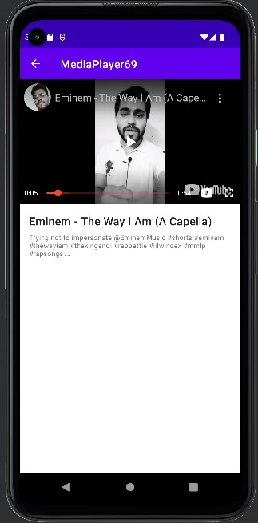
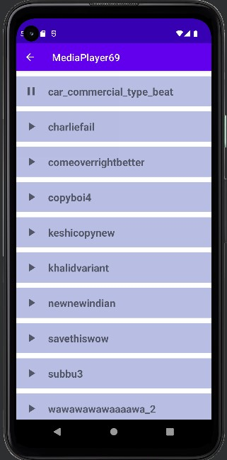
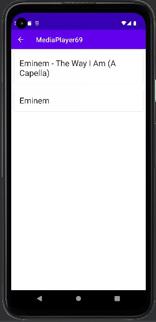

# MediaPlayers
## Project team 69
A revolutionary Android app that can view/play various media. 
Media include Spotify songs, YouTube videos, and songs in your device...sort of

<h1 align="center">Home Screen</h1>

  

<h1 align="center">User can search and play music music on Spotify</h1>

  

<h1 align="center">User can search and play music on Spotify</h1>

  

<h1 align="center">User can search and play videos on Youtube</h1>

  

<h1 align="center">User can play music oin your device</h1>

  

<h1 align="center">Search histories are stored in local database</h1>

  

